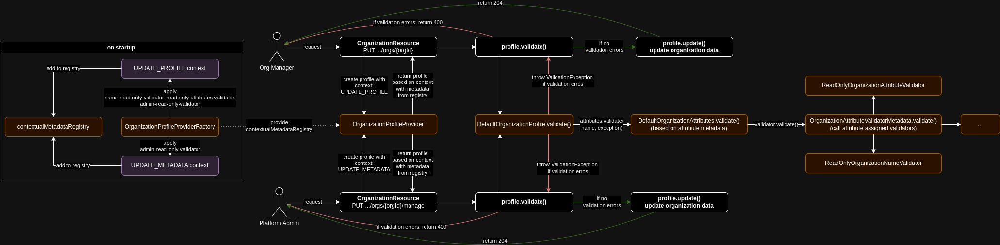
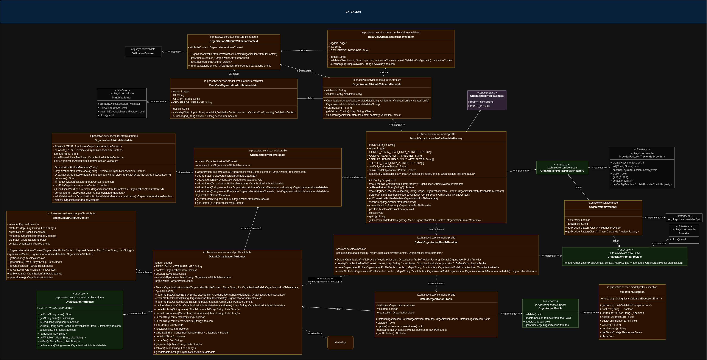
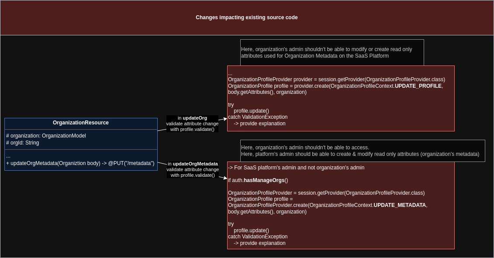

# Notice of modification
The software was modified, here is what was modified:


## Details
A read-only attribute approach was implemented based on the `declarative-user-profile` & `read-only-attribute` of Keycloak.
The scope of the modification <b>concern only the capacity to restrict modification of attributes on update flow</b>. 

However, the code was adapted to match the target use case*, but a good amount of the base code to implement a `declarative-organization-profile` 
similar to `declarative-user-profile`  is here.

'* for example, in some part of the code, it is assumed that the attribute is writable where in Keycloak it's checked differently based on 
the full implementation of `declarative-user-profile`.

<br>

<b>Possible extension to fully support a `declarative-organization-profile`</b>:
- Filter attributes based on view permissions (extends `OrganizationAttributeMetadata` with `readAllowed`
- Restrict attributes on creation flow
- Attribute / Metadata configuration through API (create new resource, extend code to use external configuration)

<br>

### Default configuration

#### Organization users
Based on admin-portal UI, there is a default implementation specifying that organization users can't 
modify the organization's name but can modify the display name.

There is a default pattern implemented for read-only-attributes: `"org_ro_*"`
Meaning that all attributes created under org_ro_ can't be modified by organization manager (with organization 
role `manage-organization`) but can be modified by platform admins (with realm-role `manage-organizations`). <br>
Example: `org_ro_test`

<br>

#### Platform administrators
There is a default pattern implemented for admin-read-only-attributes: `"admin_org_ro_*"`
Meaning that all attributes created under admin_org_ro_ can't be modified by organization manager and by platform administrator. <br>
Example: `admin_org_ro_test`

<br>

### Extending configuration
Read only attributes can be extended with spi configuration with `--spi-organization-profile-organization-profile-read-only-attributes=...`<br>
Example: `--spi-organization-profile-organization-profile-read-only-attributes=tiers`

Read only attributes can be extended with spi configuration with `--spi-organization-profile-organization-profile-admin-read-only-attributes=...`<br>
Example: `--spi-organization-profile-organization-profile-admin-read-only-attributes=admin_ro=idp_metadata_*`

-----

## API details
A new endpoint was added for platform admin to manage organization read only attributes: `PUT .../orgs/{org-id}/manage`. <br>
The existing endpoint `PUT .../orgs/{org-id}` was modified to first validate that an organization user doesn't try to modify a read only attribute. 

If the modification is successful, the response code is 204 with no content. <br>
If the modification is rejected due to not allowed attributes modification, the response code is 400 with details in response:
- Case of 1 validation error
```json
{
    "field": "READ-ONLY-ATTRIBUTE-NAME", 
    "errorMessage": "update-read-only-attributes-rejected-message", 
    "params": [
        "READ-ONLY-ATTRIBUTE-NAME"
    ]
}
```

- Case of multiple validation error (with name modification)
```json
{
    "errors": [
        {
            "field": "READ-ONLY-ATTRIBUTE-NAME",
            "errorMessage": "update-read-only-attributes-rejected-message",
            "params": [
              "READ-ONLY-ATTRIBUTE-NAME"
            ]
        },
        {
            "field": "name",
            "errorMessage": "update-read-only-name-rejected-message",
            "params": [
                "name"
            ]
        }
    ]
}
```



<br>

-----

## File modification list
- io.phasetwo.service.model.OrganizationProfileSpi: ADDED
- io.phasetwo.service.model.OrganizationProfileProviderFactory: ADDED
- io.phasetwo.service.model.OrganizationProfileProvider: ADDED
- io.phasetwo.service.model.OrganizationProfile: ADDED
- io.phasetwo.service.model.profile.*: ADDED
- io.phasetwo.service.model.OrganiztionModel: MODIFIED
  - added `String NAME = "name";`
- io.phasetwo.service.resource.OrganizationResource: MODIFIED
  - The updateOrg flow was modified to first validate attribute change.
    - organization users can't modify attributes protected under `admin-read-only-attributes` and `read-only-attributes` and can't modify organization name.
  - The updateOrgMetadata flow was added to allow platform admins (with `manage-organizations`) to update `read-only-attributes`
    - platform admin can't modify attributes protected under `admin-read-only-attributes`

<br>

**Added code:**




**Modified code:**



And `OrganizationModel` interface to provide "NAME"